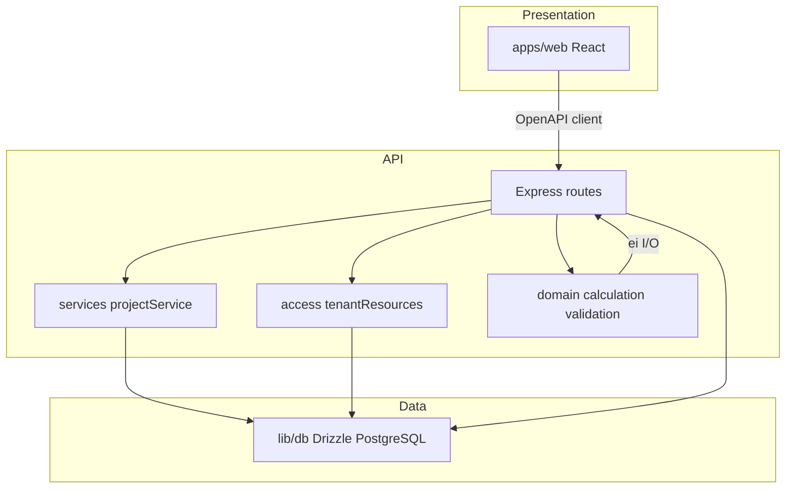

# Finni — järjestelmäspesifikaatio (tavoiterakenne)

Tämä dokumentti kuvaa **miten** koodi ja infra on järjestettävä, jotta Cursor ja kehittäjät pysyvät linjassa liiketoiminnallisen tavoitteen kanssa ([PRODUCT_SPEC.md](./PRODUCT_SPEC.md)).

## Kerrokset

| Kerros | Vastuu | Ei saa |
|--------|--------|--------|
| **apps/web** | Sivut, lomakkeet, taulukot, navigointi; `components/feedback` (lataus/virhe) | Duplikaattibisneslogiikkaa; käytä generoitua clientia ja ohuita apureita (esim. `format.ts`) |
| **apps/api** | HTTP, sessio, auktorisointi, DTO:t | Monimutkaista laskentaa suoraan reitin sekaan pitkänä — siirrä `domain/`- alle |
| **services/** | Tenant-scope DB-operaatiot (esim. projektilista, dashboard-yhteenveto) — kutsuu `lib/db` | Domain-logiikkaa (siitä `domain/`) |
| **auth/** | Roolivakiot (`TENANT_EDITOR_ROLES`, `VERSION_LOCK_ROLES`) | — |
| **http/** | Jaetut HTTP-apurit (esim. paginointi querystä) | — |
| **access/** | `getProjectForTenant`, `getVersionWithProjectForTenant`, `getDraftVersionForTenant` jne. | — |
| **domain/** | Puhtaat funktiot: moduulilaskenta, validointilistat | Tietokantakutsuja |
| **lib/db** | Skeemat, migraatiot, yhteys | — |

## Tenant ja auktorisointi

1. **Totuuden lähde**: `req.session.tenantId` ja `req.session.userId` — ei luoteta clientin lähettämään `tenantId`:tä muutospoluissa.
2. **Kaksi tasoa**: (a) kirjautunut (`requireAuth`), (b) rooli + resurssi (projekti/version kuuluu tenantille).
3. **Muokkausoikeus dataan**: `requireTenantEditor` (admin + editor). **Lukitus**: admin + reviewer. **Viewer**: pääosin luku.

## Deterministinen laskenta

- Tuoterivillä **snapshot-kentät** päästölähteestä (`co2ePerUnitSnapshot`, `emissionUnitSnapshot` jne.).
- Kaava: `quantity × co2ePerUnitSnapshot × moduleShare` moduuleittain; moduuliosuuksien summa = 1.0 per tuote (validointi).
- Lukittu versio: ei tuotemuutoksia (HTTP 400), ellei erikseen määritellä poikkeusta.

## Päästökatalogi

- `emission_factors.tenant_id IS NULL`: alustan jaettu katalogi (MVP-seed).
- `tenant_id` asetettu: tenantin oma rivi (tuleva EPD / hallinta).
- API palauttaa rivit, joissa `tenant_id` on null **tai** nykyinen tenant.

## Sopimukset ja generointi

- **OpenAPI**: `lib/api-spec/openapi.yaml` on API:n julkinen sopimus.
- **Client**: `lib/api-client-react` generoidaan (orval); muutokset speksiin ensin, sitten codegen.
- **Zod**: `lib/api-zod` vastaa generoitua validointia / tyyppejä tarpeen mukaan.

## Observability ja deployment

- **Lokitus**: strukturoitu (Pino); ei sähköposteja salasanoissa; `cookie` / auth-header redactoitu loggerissa missä määritelty.
- **Request ID**: `X-Request-ID` tai generoitu id; välittyy lokeihin.
- **Proxy**: aseta `TRUST_PROXY=1` tai `BEHIND_PROXY=1` kun API:n edessä on reverse proxy (oikeat client-IP:t ja `secure`-cookie).
- **Session**: PostgreSQL session store; usean noden käyttö: jaettu store tai sticky sessions.

## Tietomalli (looginen)

- **Tenant** → **User** (tenant_id)
- **Project** (tenant_id)
- **Version** (project_id, status)
- **Product** (version_id, snapshot-kentät)
- **Building** / **spaces** (projektikohtainen toteutus)
- **Report** (version_id, tiedostopolku)
- **AuditLog** (tenant_id, entity)

Ei erillistä `calculation_result`-taulua MVP:ssä — tulokset johdetaan domain-funktiolla samoista syötteistä.

---

**Nykytila ja aukot:** [PROJECT_STATUS.md](./PROJECT_STATUS.md).
